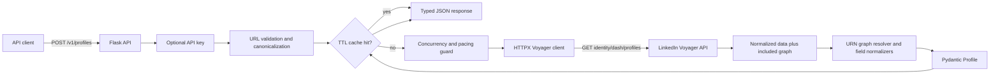

# Architecture

## Goal and constraint

The service converts one LinkedIn `/in/` URL into a stable JSON contract by calling LinkedIn's reverse-engineered Voyager/Dash HTTP endpoint directly. The runtime contains no browser automation, DOM parsing, Selenium, Playwright, or Chromium.

## Request flow



## Endpoint

```http
GET https://www.linkedin.com/voyager/api/identity/dash/profiles
    ?q=memberIdentity
    &memberIdentity={public_identifier}
    &decorationId=com.linkedin.voyager.dash.deco.identity.profile.FullProfileWithEntities-101
```

Required session material and headers:

```http
Cookie: li_at={secret}; JSESSIONID="ajax:..."
csrf-token: ajax:...
accept: application/vnd.linkedin.normalized+json+2.1
x-restli-protocol-version: 2.0.0
x-li-lang: en_US
```

`csrf-token` is derived from `JSESSIONID` with surrounding quotes removed. Both cookie values are supplied only through environment secrets.

## Normalized graph parsing

Voyager does not return a conventional nested profile. The requested profile URN appears at `data.*elements[0]`; the actual records appear in `included[]` and reference other entities by URN.

The parser builds an O(n) index:

```text
entityUrn -> included entity
```

It resolves the target profile from the root URN instead of selecting the first `Profile` record, because one response may contain referenced profiles. Experience requires this graph walk:

```text
Profile.*profilePositionGroups
  -> CollectionResponse.*elements
    -> PositionGroup.*profilePositionInPositionGroup
      -> CollectionResponse.*elements
        -> Position
```

This prevents unrelated/stale positions elsewhere in `included[]` from leaking into the response. Education, skills, certifications, and languages use their respective profile-owned collection references.

## Components

| Component | Responsibility |
|---|---|
| `app/__init__.py` | Application factory, request IDs, API-key protection, response headers |
| `app/api.py` | HTTP routes and response envelope |
| `app/services/profile_service.py` | URL allow-listing, canonicalization, TTL cache |
| `app/scrapers/base.py` | Replaceable scraper/transport boundary |
| `app/scrapers/voyager.py` | Direct HTTP transport, cookie/CSRF authentication, pacing, graph parsing |
| `app/models.py` | Typed public schema |
| `app/errors.py` | Stable problem+json errors |

## Failure model

- Invalid or non-LinkedIn input: `422`, before any upstream request.
- Missing/expired cookies or LinkedIn `401/403`: `503 linkedin_authentication_required`.
- Missing profile: `404 profile_not_found`.
- LinkedIn `429`: `429 linkedin_rate_limited`; the client does not retry automatically.
- Timeout, transport failure, schema drift, or upstream `5xx`: `502 upstream_scrape_failed`.
- Local concurrency exhaustion: `503 scraper_busy`.

## Security and privacy

- Only canonical LinkedIn `/in/{id}` URLs reach the transport, preventing SSRF and lookalike-domain attacks.
- Cookie secrets are never accepted by the public API, returned, or logged.
- Control characters and semicolons are rejected in individual cookie values before constructing the Cookie header.
- API-key comparison is constant-time when public endpoint protection is enabled.
- Responses use `Cache-Control: no-store` because profiles may contain personal data.
- Captured live Voyager responses must never be committed; test fixtures must be synthetic or fully redacted.

## Scaling

HTTP requests are substantially lighter than browser processes. A persistent HTTPX client provides connection pooling and HTTP/2 per Gunicorn worker. The current cache, semaphore, and pacing clock are process-local. For multiple instances, use Redis for shared cache, distributed rate limiting, and single-flight locks.

The scraper intentionally makes one decorated profile request per cache miss and stops immediately on `429`. Increase throughput through caching and request coalescing, not aggressive upstream concurrency.

